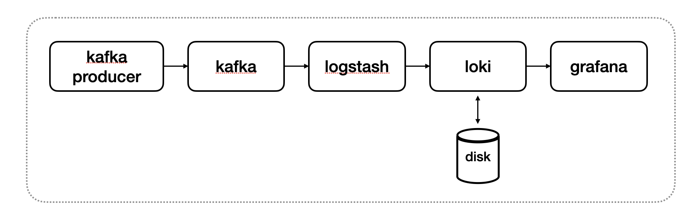

# Kafka + Logstash + Loki + Grafana

## Architecture



## Prerequisites

### Install docker

```
sudo yum remove docker \
                  docker-client \
                  docker-client-latest \
                  docker-common \
                  docker-latest \
                  docker-latest-logrotate \
                  docker-logrotate \
                  docker-engine
sudo yum install -y yum-utils
sudo yum-config-manager --add-repo https://download.docker.com/linux/centos/docker-ce.repo
sudo yum install docker-ce docker-ce-cli containerd.io docker-compose-plugin
sudo systemctl enable docker
sudo systemctl start docker
```

add Docker Group Permissions to Users

```
sudo groupadd docker
sudo usermod -aG docker ${USER}
```

### Install docker-compose

```
sudo curl -L "https://github.com/docker/compose/releases/download/1.27.4/docker-compose-$(uname -s)-$(uname -m)" -o /usr/local/bin/docker-compose

sudo chmod +x /usr/local/bin/docker-compose
```

## Configuration

### set kafka address

open `.env` and set `KAFKA_ADDRESS` to ip of host.

```
KAFKA_ADDRESS=172.31.52.108
```

### add topics

open `logstash/pipeline/loki.conf`. add or change topic in topics field.

```
input {
    kafka {
        bootstrap_servers => "kafka:9092"
        group_id => "logstash"
        topics => ["test"]
        consumer_threads => 1
        decorate_events => true
    }
}
```

### Change ID & Password For Grafana

You can change the ip&password in `grafana/grafana.ini`.

```
[security]
admin_user = root
admin_password = 1234
```

## Start & Stop

### Start

run docker-compose

```
cd /home/centos/Test_Episoden_Logging

docker-compose up -d
```

### Stop

stop docker-compose

```
docker-compose down
```
